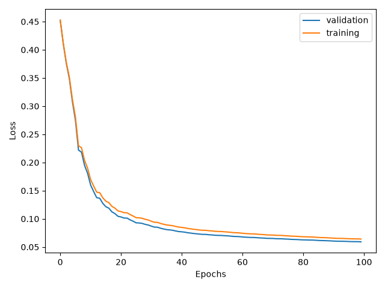

# ANN_project
Project 2 for course NUMN21.

## Example of the input images

## Task 6 (Output of the learning success per epoch)

```
Epoch 1  Training loss: 4.5568e-01  Validation loss: 4.5589e-01  Validation accuracy: 20.87%
Epoch 2  Training loss: 4.0797e-01  Validation loss: 4.0732e-01  Validation accuracy: 44.33%
Epoch 3  Training loss: 3.8779e-01  Validation loss: 3.8680e-01  Validation accuracy: 50.36%
Epoch 4  Training loss: 3.1656e-01  Validation loss: 3.1318e-01  Validation accuracy: 69.35%
Epoch 5  Training loss: 2.6518e-01  Validation loss: 2.5953e-01  Validation accuracy: 78.94%
```

## Task 8 (Challenge best result)

> Reached loss: 0.0, in 85 epochs using 3 hidden nodes.

# Extension

## Task 2 (Comparison of the bitwise representation)
 > After 10 epochs we end up with the training loss of 0.19156, the validation loss of 0.27674 and validation accuracy of 93.17%. The test accuracy is 92.93%. During this process 39 predictions were invalid (predicted larger than zero). The confusion matrix is the following:

Figure_bitwise

## Task 5 (Results after the additional attack)

Ran the decision boundary walk attack to generate 500 new images with a maximum distance from valid, correctly classified images, of 10.0 in the 2-norm. By definition, the accuracy of the model on those images is 0%. After training on the model again, we ran the attack one more time, and the model shows some robustness at resisting the same attack.

```
    --- Starting test accuracy ---
Train accuracy: 0.9599
Test accuracy: 0.9535

    --- First Boundary Adversarial Attack (500 new images) ---
Adversarial accuracy: 0.0
Failed adv generation attempts: 1

Mean - 3.7299 | StD - 1.9247
Largest - 9.9233 | Smallest - 0.1309

   --- After training the model on the new images appended to a large subset of old training data ---
Adversarial accuracy: 1.0
Test accuracy: 0.9465

    --- Second Boundary Adversarial Attack (500 new images) ---
Adversarial accuracy: 0.0
Failed adv generation attempts: 57

Mean - 4.7979 | StD - 2.11
Largest - 9.9644 | Smallest - 0.2175
```

## Contributions

We have all individually finished the assignment and then decided to combine the best parts of each of our codes.
- Linn Preuss Jelvez - Minimization of neural network size for the overfit competition.
- Lukas Nord - Minimization of neural network size for the overfit competition, using questionable methods. 
- Scott Gibson - Decision Based Boundary Adversarial Attack
- Orsolya Bosáková - Bitwise representation implementation and comparison

## TO DO:
- Finish the readme
- Update slides for presentation
- (Optional) Add another attack
