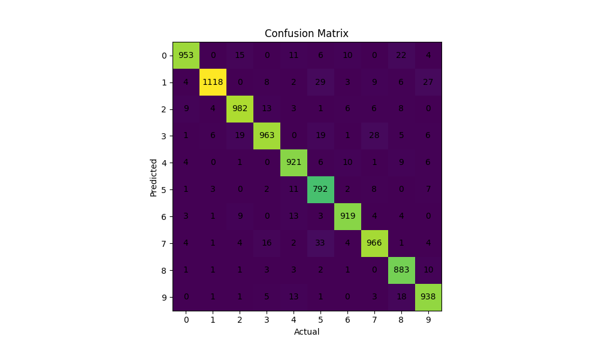
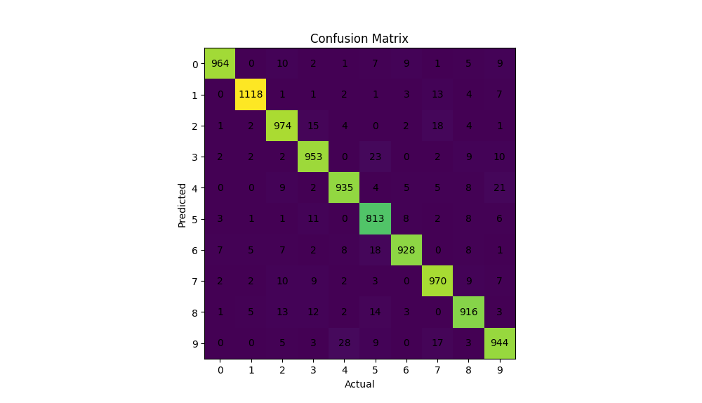
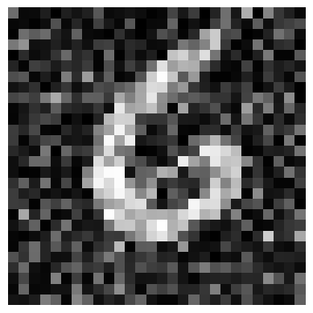
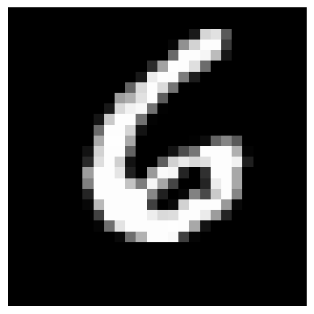
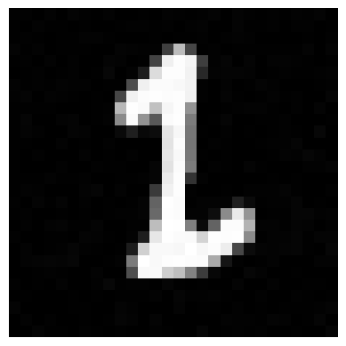
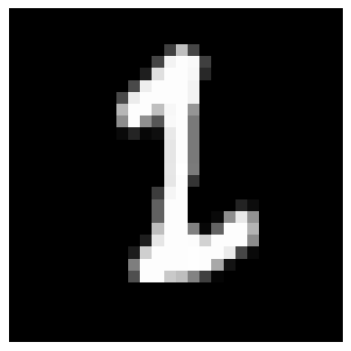

# ANN_project
Project 2 for course NUMN21.

## Files and Usage Notes

- **Modules:** Implementation Code
    - `ANN.py`: Neural network class, loss, and activation functions.
    - `black_box_attack.py`: Adversarial attack using steps along the decision boundary.
    - `data_io.py`: Useful functions for reading in data, and saving data images.
- **Scenarios:** Scripts running various tasks on the neural net (ANN) class.
    - `run_bitwise.py`: Trains ANN with 4 output neurons (bit-wise encoded).
    - `run_black_box_attack.py`: Attacks trained network with boundary attack, then re-trains on those generated samples.
    - `run_competition_maybe.py`: Competition attempt with only 3 hidden neurons.
    - `run_onehot.py`: Trains ANN with 10 output neurons (one-hot encoded).
- **Example_usage.py:** Reference for model parameters and useful features.

---

To run any of the Scenarios, `cd` into the scenarios folder and run the files from there.

## Example of the input images

## Task 6 (Output of the learning success per epoch)

```
Epoch 1  Training loss: 4.5568e-01  Validation loss: 4.5589e-01  Validation accuracy: 20.87%
Epoch 2  Training loss: 4.0797e-01  Validation loss: 4.0732e-01  Validation accuracy: 44.33%
Epoch 3  Training loss: 3.8779e-01  Validation loss: 3.8680e-01  Validation accuracy: 50.36%
Epoch 4  Training loss: 3.1656e-01  Validation loss: 3.1318e-01  Validation accuracy: 69.35%
Epoch 5  Training loss: 2.6518e-01  Validation loss: 2.5953e-01  Validation accuracy: 78.94%
```

## Task 8 (Challenge best result)

> Reached loss: 0.0, in 85 epochs using 3 hidden nodes.

# Extension

## Task 2 (Comparison of the bitwise representation)

```
Epoch 1  Training loss: 4.4777e-01  Validation loss: 4.4367e-01  Validation accuracy: 89.34%
Epoch 2  Training loss: 2.7868e-01  Validation loss: 3.0124e-01  Validation accuracy: 93.16%
Epoch 3  Training loss: 2.7631e-01  Validation loss: 3.1325e-01  Validation accuracy: 92.53%
Epoch 4  Training loss: 2.0057e-01  Validation loss: 2.4893e-01  Validation accuracy: 94.50%
Epoch 5  Training loss: 1.8104e-01  Validation loss: 2.4624e-01  Validation accuracy: 94.43%
Epoch 6  Training loss: 1.6453e-01  Validation loss: 2.4137e-01  Validation accuracy: 94.52%
Epoch 7  Training loss: 1.4649e-01  Validation loss: 2.2981e-01  Validation accuracy: 94.75%
Epoch 8  Training loss: 1.2567e-01  Validation loss: 2.2570e-01  Validation accuracy: 94.91%
Epoch 9  Training loss: 1.1457e-01  Validation loss: 2.1984e-01  Validation accuracy: 94.98%
Epoch 10  Training loss: 1.1185e-01  Validation loss: 2.3131e-01  Validation accuracy: 94.58%
```

 > After 10 epochs we end up with the training loss of 0.11185, the validation loss of 0.23131 and validation accuracy of 94.58%. The test accuracy is 94.35%. During this process 39 predictions were invalid (predicted larger than zero). The confusion matrix is the following:



```
Epoch 1  Training loss: 9.9003e-02  Validation loss: 8.9610e-02  Validation accuracy: 90.77%
Epoch 2  Training loss: 7.7001e-02  Validation loss: 6.9797e-02  Validation accuracy: 92.15%
Epoch 3  Training loss: 6.7655e-02  Validation loss: 6.1668e-02  Validation accuracy: 92.95%
Epoch 4  Training loss: 6.1049e-02  Validation loss: 5.6013e-02  Validation accuracy: 93.81%
Epoch 5  Training loss: 5.5913e-02  Validation loss: 5.1953e-02  Validation accuracy: 94.24%
Epoch 6  Training loss: 5.2138e-02  Validation loss: 4.8883e-02  Validation accuracy: 94.43%
Epoch 7  Training loss: 4.9149e-02  Validation loss: 4.6440e-02  Validation accuracy: 95.00%
Epoch 8  Training loss: 4.6300e-02  Validation loss: 4.4301e-02  Validation accuracy: 95.16%
Epoch 9  Training loss: 4.4012e-02  Validation loss: 4.2247e-02  Validation accuracy: 95.52%
Epoch 10  Training loss: 4.1448e-02  Validation loss: 4.0315e-02  Validation accuracy: 95.67%
```

 > After 10 epochs we end up with the training loss of 0.041448, the validation loss of 0.040315 and validation accuracy of 95.67%. The test accuracy is 95.15%. The confusion matrix is the following:



 > Overall, we can see that the onehot start gets better results.

## Task 5 (Results after the additional attack)

Ran the decision boundary walk attack to generate 500 new images with a maximum distance from valid, correctly classified images, of 10.0 in the 2-norm. By definition, the accuracy of the model on those images is 0%. After training on the model again, we ran the attack one more time, and the model shows some robustness at resisting the same attack.

```
    --- Starting test accuracy ---
Train accuracy: 0.9599
Test accuracy: 0.9535

    --- First Boundary Adversarial Attack (500 new images) ---
Adversarial accuracy: 0.0
Failed adv generation attempts: 1

Mean - 3.7299 | StD - 1.9247
Largest - 9.9233 | Smallest - 0.1309

   --- After training the model on the new images appended to a large subset of old training data ---
Adversarial accuracy: 1.0
Test accuracy: 0.9465

    --- Second Boundary Adversarial Attack (500 new images) ---
Adversarial accuracy: 0.0
Failed adv generation attempts: 57

Mean - 4.7979 | StD - 2.11
Largest - 9.9644 | Smallest - 0.2175
```

### Example of a poor adversarial image

The generated image had a diff in the 2-norm of ~6.57.




### Example of a good adversarial image

The generated image had a diff in the 2-norm of ~0.26.




## Contributions

We have all individually finished the assignment and then decided to combine the best parts of each of our codes.
- Linn Preuss Jelvez - Minimization of neural network size for the overfit competition.
- Lukas Nord - Minimization of neural network size for the overfit competition, using questionable methods. 
- Scott Gibson - Decision Based Boundary Adversarial Attack
- Orsolya Bosáková - Bitwise representation implementation and comparison

## TO DO:
- Finish the readme
- Update slides for presentation
- (Optional) Add another attack
